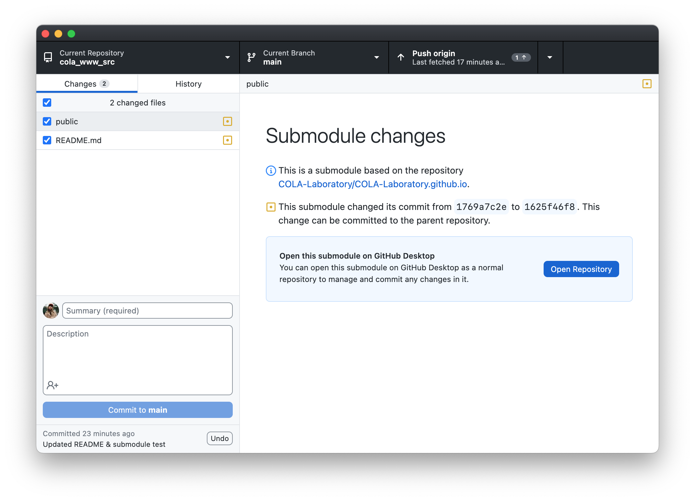
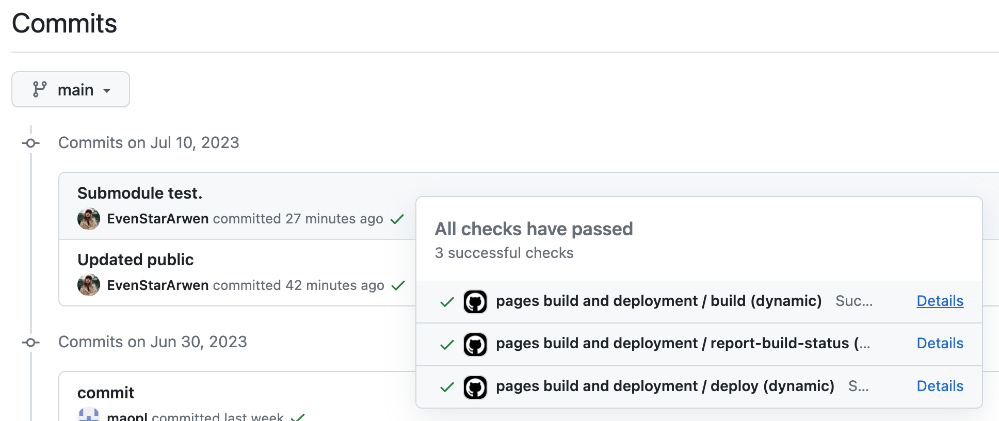

# cola_www_src
This is the HUGO source file of the website of COLA Laboratory. Below is a simple guide for working with this project.

## 1. Get the Project Source File

The whole project is hosted on two seperate Github repositories:

- COLA-Laboratory/cola_www_src: The source file of the COLA website, which is based on [HUGO](https://gohugo.io/).
- [COLA-Laboratory/COLA-Laboratory.github.io.](https://github.com/COLA-Laboratory/COLA-Laboratory.github.io): The compiled HTML files of the website used to host the GitHub pages.

The latter is linked to the `public` folder of this repository as a [submodule](https://github.blog/2016-02-01-working-with-submodules/).

Therefore, to clone this project to your local machine, you should use the following command (a *recursive* clone) to clone both this repository and the dependent submodule (i.e., COLA-Laboratory/COLA-Laboratory.github.io):

```
git clone --recurse-submodules https://github.com/COLA-Laboratory/cola_www_src.git
```

Alternatively, you could also do this on the [Github Desktop](https://desktop.github.com/) interface, which may automatically clone both repositories. The desktop manager is recommended for developers in China mainland as it generally has better network stability. 

## 2. Develop the Website with HUGO

### 2.1 Download HUGO

After cloned both repositories on your local machine, you could start to modify the website. The whole project is based on [HUGO](https://gohugo.io/installation/) (please make sure to download this on your local machine before procedding), and is surprisingly easy to work with.

### 2.2 Editing Source Files 

Each page of the website is a **Markdown** file in the `content` folder. You could edit the markdown files directly following simple markdown syntax, or, using advanced HTML or CSS syntax to enable more customized functions.

During this process, you may open the whole project folder with your IDE (e.g., Visual Studio Code), or edit each markdown files with a text editor independently. 

You may get started quicker if you have some basic knowledge of Markdown, HTML and CSS, or, you may refer to [Hugo Book Theme](https://hugo-book-demo.netlify.app/posts/) documentation, which is the template used by COLA's website. This documentation generally covers all the basic operations you need to know to develop the website.

### 2.3 Compile and Inspect Your Changes Locally

To get a glimpse at what the modifed website would look like, in you command line, navigate to the directory of the source repository (cola_www_src), and run:

```
hugo
```

This command would compile the source files and generate the website in the `public` folder. You could then open the `index.html` file in the `public` folder to see the website (which is however, not recommended). A better way to inspect your changes is to use the following command:
    
```
hugo server
```

It would start a local server and which would automatically update the website when you make changes to the source files. You could then open the website in your browser at `localhost:1313`. It will show you exactly the same version of what your website would look like online. 

This is just like the LaTeX workflow, where you could inspect your changes instantly (and locally) before deploying the website. You may use IDEs like Visual Studio Code to edit the source files.

## 3. Deploy the Website

After you have made your changes on your local machine, you could then deploy the new website to make it available online. However, since two linked repostories are involed in this project, you should commit & push the changes in a specific order. There are two ways to do this:

### 3.1. Deploy via Github Desktop

Before development, remember to use the `hugo` command to compile the source file (which will automatically update the `public` folder in the cola_www_src repository). (You would also want to inspect your new website locally before proceeding using `hugo server`).

Then in you Github Desktop you would be able to see the changes both in your source files and the `public` directory. The App will notice you with "Submodule changes" and you should follow the guide to **first open the COLA-Laboratory.github.io submodule and commit & push changes within it.**

<div class="item1" style="text-align:center">
    
</div>

Once you have pushed the modifications, the online server would begin to compile the updates, and you should be able to see the changes in the website in a few minutes. You could also track this process in the commit history of the .io repository by clicking the brown circle (when successfully deployed, it will turn into a green tick).

<div class="item1" style="text-align:center">
    
</div>

**Now, you could return to the src repository and commit & push the changes in the source files (cola_www_src)**. This is also important, since if you only update the .io repository, then the website would be updated, but the source files would not, and the next time you (or others) clone the repository, you would not be able to see the changes you made before.

### 3.2. Deploy via Command Line

All the commands needed to conduct the aforementioned operations are included in the `deploy.sh` file (you could check the details by opening it with a text editor). Generally, the idea is to first commit & push the changes in the COLA-Laboratory.github.io repository, and then commit & push the changes in the cola_www_src repository.

Just make your changes. Then run:

```
bash deploy.sh
```

To deploy your changes. You will need your github username and password or authentication token.
